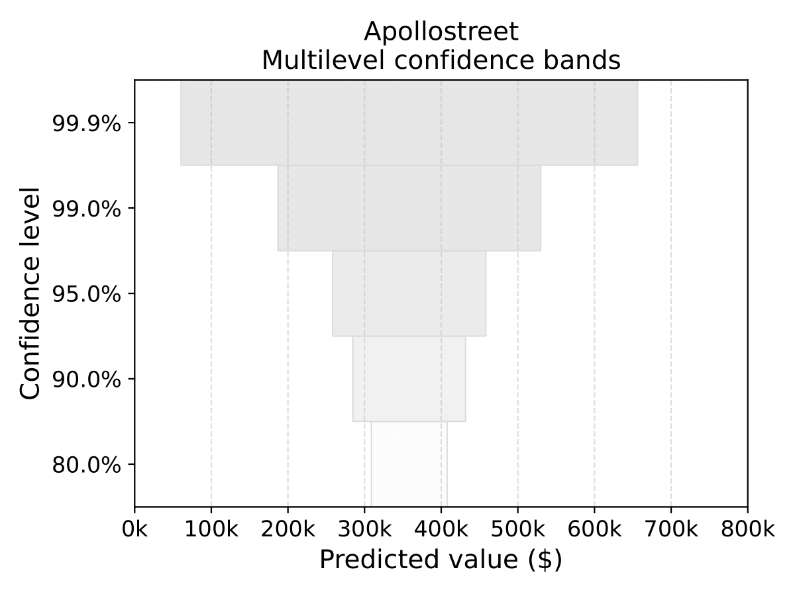

# multilevel-confidence-bands
> Uncertainty visualizations for conformalized regression models.

_This repository contains materials supporting a research paper currently under review._

# Evaluating the Effectiveness of Graded Error Bars and Multilevel Confidence Bands in Conformalized Regression

## 📘 Overview
This repository contains reproducible code, experiments, figures, and supplementary materials for a study evaluating the effectiveness of a newly designed uncertainty visualization for regression models: **Multilevel Confidence Bands (MCBs)**.

📈 MCB example for the Apollostreet price prediction task.
<p align="center">
  
</p>


We first derive reliable predictive uncertainty estimates using an **Explainable Boosting Machine (EBM)** combined with **conformal prediction**. We then investigate how this uncertainty information can be effectively communicated to users through an **online AI-assisted decision-making experiment** based on the *California Housing* dataset.

The experiment compares:
- **Multilevel Confidence Bands (MCBs)**,
- **Classical graded error bars (GEBs)**, and
- A **no-AI baseline**.

Additional methodological details and experimental materials are documented on the Open Science Framework (OSF):  
👉 https://osf.io/5w9kj/wiki?wiki=g2u97

---

## 🔁 Reproducibility
All analyses are fully reproducible using Python.

### 1. Create and activate the environment
```bash
conda create -n mcb_env_313 python=3.13
conda activate mcb_env_313
```

### 2. Install dependencies
```bash
pip install -r requirements.txt
pip install interpret==0.7.2 --no-deps
```
⚠️ This last step is required to keep interpret==0.7.2 while forcing
interpret-core==0.6.9, which matches the environment used for the simulations.


### 3. Running the analysis in JupyterLab
To run the notebooks in JupyterLab:

```bash
pip install jupyterlab
pip install ipykernel
python -m ipykernel install --user --name mcb_env_313 --display-name "mcb_env_313"
```

Then launch JupyterLab:
```bash
jupyter lab
```
You should now be able to select the mcb_env_313 kernel when opening the notebooks.

---

## 📚 References and some related work
- Lou et al. (2012). *Intelligible Models for Classification and Regression.*
- Nori et al. (2019). *Interpretable Machine Learning: The Glassbox Approach.*
- Vovk et al. (2005). *Algorithmic Learning in a Random World.*
- Romano et al. (2019). *Conformalized Quantile Regression.*
- Kay et al. (2016). *When (ish) is My Bus? User-centered Visualizations of Uncertainty in Everyday, Mobile Predictive Systems.*
- Hullman (2020). *Why Authors Don’t Visualize Uncertainty.*